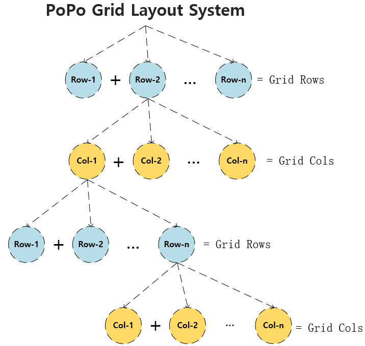
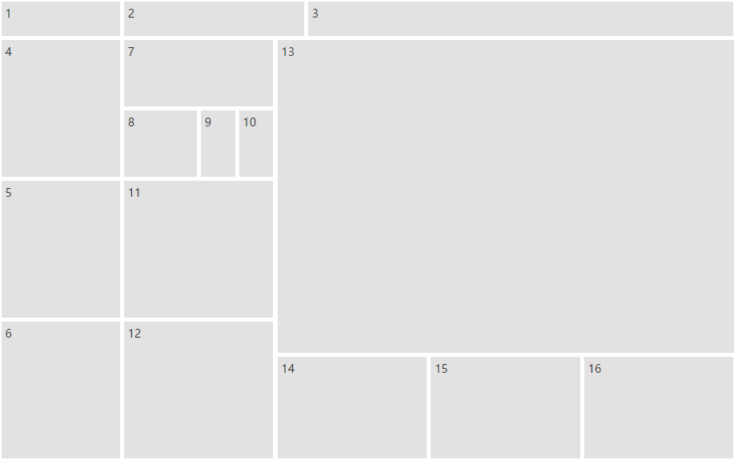
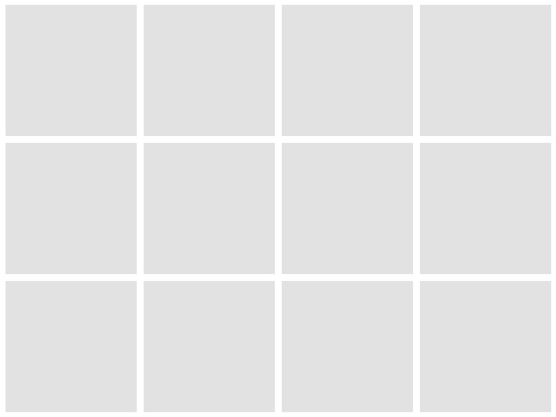

# Grid Layout

The final rendering of the page is determined by the style, layout and content, and layout is often the first place in the page development. Most of the mainstream CSS or UI framework layout includes the technical points：[Floats](https://developer.mozilla.org/en-US/docs/Learn/CSS/CSS_layout/Floats),[Positioning](https://developer.mozilla.org/en-US/docs/Learn/CSS/CSS_layout/Positioning),CSS tables,[Flexbox](https://developer.mozilla.org/en-US/docs/Learn/CSS/CSS_layout/Flexbox),[Grid](https://developer.mozilla.org/en-US/docs/Learn/CSS/CSS_layout/Grids), Grid has not yet officially been included in the standard.

Along with the deepening of the front-end technology in various application fields, with more and more application front-end technology development, has many applications and is very suitable for the ranks of two-dimensional layout, such as visualization of large screen monitoring and command center, desktop program, advertising machine, TV terminal, monitoring, control and other applications of things, such as the use of one-dimensional in the column, the need for additional configuration or compile line layout..

** Is there an ideal layout method that can solve the layout problem similar to the above application development?**

?> 1. whether you can use the two-dimensional layout system of one-dimensional alternative determinant layout, to meet all the needs of the project, [Grid] (https://developer.mozilla.org/en-US/docs/Learn/CSS/CSS_layout/Grids) is a better alternative?

?> 2. Can grid systems be created at runtime instead of pre compiled?

?> 3. Is there a program with high flexibility without the need for UI customization (such as DataV's drag and drop absolute positioning layout)?

?> 4. Can you match different screens at the same time?

?> 5. Complex layouts make code structures tedious and difficult to read, and can you make code easier to read without writing layout code?

Based on the above five questions, PoPo was born!

## Layout model

We try to construct the analytic layout using `bootstrap` grid system, usually determined from `row` start, and then determine the column distribution of `col` in `row`, `row` and `col` formed by the layout. The following is a typical grid layout code fragment:

```html
<!-- A typical boostrap grid -->
<div class="row">
  <div class="col-md-8"></div>
  <div class="col-md-4"></div>
</div>
```
The actual need to nest more layers to meet the needs of the style and content, the more complex layout, the deeper the nesting layer.

```html
<div class="row">
  <div class="col-md-8">
    <div class="row">
      <div class="col-md-6">
        ...
      </div>
      <div class="col-md-6">
        ...
      </div>
    </div>
  </div>
</div>
```

The above raster layout structure has a very simple law, that is, the first definition of the line, and then define the corresponding row of the column distribution, column distribution and then define the line, the line to define the column distribution ... ... Nesting, you can use a tree , As shown below, This is also the theoretical model of the PoPo grid system layout.



Multidimensional array can be a good expression of the above structure, we take the following layout as an example:
```html
<div class="row">
  <div class="col-md-6"></div>
  <div class="col-md-6"></div>
</div>
```
Suppose we use `rows 8, cols 12` 8 rows and 12 columns of raster systems, we use a two-dimensional array to express the structure and relationship between them:


If we continue to nest a layer, how to express it?
```html
<div class="row">
  <div class="col-md-6">
     <div class="row">
          <div class="col-md-6"></div>
          <div class="col-md-6"></div>
     </div>
  </div>
  <div class="col-md-6"></div>
</div>
```


You can see that nesting a layer can also be represented by an array, and we can similarly nest multiple layers, each with an array of two dimensions.

## Layout expression

> Finally, we will be the entire raster layout of the basic structure of the unit is defined as a two-dimensional array, according to the different types of starting, divided into two kinds:


PoPo layout expressions have the following characteristics:

- The first number of the expression array, if its type is `row`, if the first expression represents the row, the column to the right of the number is represented by the column corresponding to that row.

- The first number of the expression array, if its type is `col`, if the second expression is a column, the right array of the same level is represented by the row corresponding to that row.

- The sum of the first digits in the peer array can not exceed the total number of its corresponding raster types. If the first numeric type is `row`, the sum can not be greater than the total number of grid systems. If the first number type For `col`, then the sum can not be greater than the total number of grid system.

Each of the numbers in the expression can be nested according to the structure of the base unit. The array constructed according to the above rules is the PoPo grid system layout expression.

> In the case of `12 rows * 24 cols` 12 lines * 24 column grid systems, the following expressions meet the requirements:

```js
// The outermost layer brackets indicate the set of layout expressions, and the following starting types are row

// A row of three columns, a standard expression
[[12,  [8, 8, 8]]]

// A row, a standard expression
[[12,  [24]]]

// A row and a column, abbreviated expression
[[12]]

// A row, minimalist, only the outermost shorthand
[12]

// Uniform 3 rows and 3 columns A total of 9 grid grid layouts
[[4, [8, 8, 8]], [4, [8, 8, 8]], [4, [8, 8, 8]]]

// Uneven mixed layout
[[1],  [11,  [[4,  [4,  4,  4]],  [4, [2, 2, 2, 2, 4]],  4,  4,  8]]];
[[2, [[24,  [8,  4] ]]],  [5,  [6, 12, 6]], [1] , [3, [6, 6, 6, 6]],  [1]];

```

## Free Layout

The layout of a layout expression (array) is called a free layout

```js
// Create a PoPo instance
P.init({
    container: 'container',  // Mount the container
    rows: 12,
    cols: 24,
    layout: [
      [1,  [4,  6,  14]], 
      [11,  [
        [4,  [4,  4,  4]], 
        [5,  [2,  [2,  [12,  6,  6]],  4,  4]], 
        [15,  [9,  [3,  [8,  8,  8]]]], ]
      ]
    ]
});
```

Generate free layout effect:


## Uniform layout

Uniform layout refers to the [panel](/en/panel.md)(lattice unit) generated by the grid layout, and PoPo provides a more convenient way to define a uniform layout.

```js
// Create a PoPo instance
P.init({
    container: 'container',
    rows: 12,
    cols: 24,
    layout: { // 布局配置
      cols: 4,   // The number of vertical panels
      rows: 3  // The number of horizontal panels
    },
});

```

Generate uniform layout effect：
