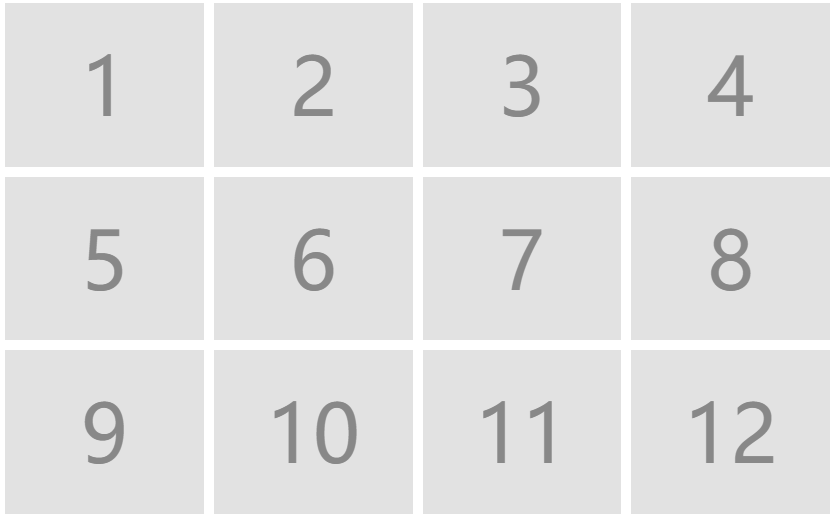

# Panel

## What's Panel

Free layout and uniform layout of the generated grid layout are called panels.PoPo automatically generates the alpha number incremented by `1`, which is the default identifier for the panel. You can also define [`alias`] (/en/configuration/layer#alias) in the Configuration to set the panel alias.

> Enable the debug configuration to see the `id` of each panel, or get the details of the panel via the instance's` get` method (with `id`)

## Panel Layout

!> For complex pages with more content elements, [raster layout] (/ en / layout) is usually used to quickly partition the functional area of the page, and the layout of the content layout is recommended.

Panel layout is a shortcut to quickly build content layout, PoPo uses a classic holy cup layout, a panel is divided into head head, left left, middle center, right side, bottom foot five areas, and free combination of configuration, Basically can meet the needs of a content area layout.

If the panel layout is configured in the PoPo instance initialization option, the panel layout is loaded after the raster system finishes panel initialization.

A typical panel layout diagram:

PoPo introduces the `gutter` parameter in the panel layout to define the spacing of adjacent panels. It actually defines the` margin` value of the middle area, and the default is `0`, without interval.